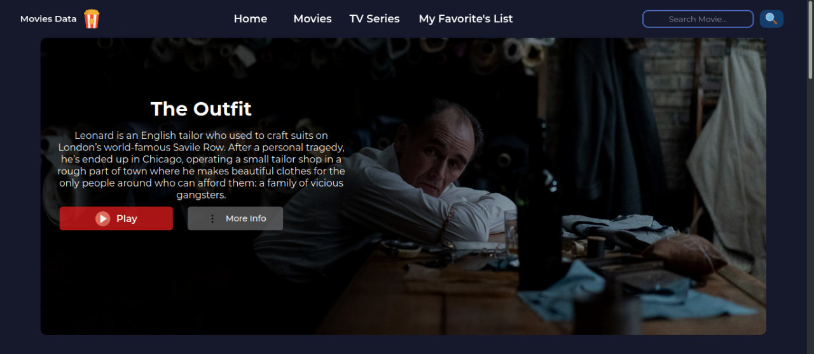

# Movie Data Page

# Check it out :t-rex:

[:heart: Movies Data Page :heart:](https://see-movie-data.vercel.app/)

## About this project :bug:

Yep, it's like a generic movies site, maybe you can't see the movies, but yo can see the trailers...if there are availables :B

You can:

    :heavy_check_mark: Check a synopsis for the movies.
    :heavy_check_mark: Make a favorites list.
    :heavy_check_mark: Search for and specific movie.

Note:warning:

If you cloned the repo and want to try it locale, you need a `Key API`, don't worry you can get it in [themoviedb](https://www.themoviedb.org/)

## API

This is the API where i consulted the data, if you can, go and check it out.

`IS AMAZING` :heart_on_fire:

[themoviedb](https://www.themoviedb.org/) :movie_camera:
